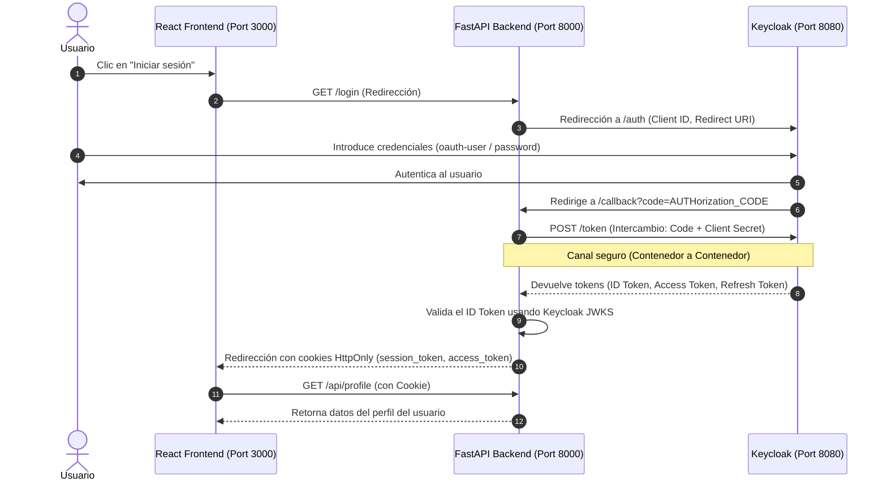

# Flujo de Autenticación OIDC (OpenID Connect)

Este documento detalla el funcionamiento paso a paso del flujo **Authorization Code Flow** con **OIDC** implementado en esta Proof of Concept.

## Diagrama del Flujo

## Explicación Detallada de los Pasos

1. **Inicio de sesión**: El usuario accede al frontend en `http://localhost:3000` y hace clic en "Iniciar sesión".
2. **Redirección de login**: El frontend envía al navegador a `http://localhost:8000/login`.
3. **Solicitud de Autorización**: El backend de FastAPI construye la URL de autorización de Keycloak con los parámetros necesarios (`client_id`, `response_type=code`, `scope=openid+profile+email` y `redirect_uri=http://localhost:8000/callback`) y redirige al usuario.
4. **Autenticación en el IdP**: Keycloak presenta la pantalla de login. El usuario ingresa sus credenciales (`oauth-user` / `password`).
5. **Generación del código**: Keycloak valida las credenciales y redirige el navegador del usuario al endpoint de callback del backend (`http://localhost:8000/callback?code=...`).
6. **Intercambio del Código (Server-side)**: El backend toma el `code` de la URL y hace una petición síncrona en el canal privado de docker (`http://keycloak:8080/realms/oauth-realm/protocol/openid-connect/token`) usando sus credenciales de cliente confidencial (`client_id` y `client_secret`) para intercambiar el código por los tokens.
7. **Emisión de Tokens**: Keycloak devuelve:
   - **ID Token**: Contiene claims que identifican al usuario (nombre, correo, username).
   - **Access Token**: Para autorizar llamadas a recursos.
   - **Refresh Token**: Para renovar el acceso sin pedir credenciales.
8. **Validación del Token**: El backend descarga los certificados JWKS de Keycloak y valida criptográficamente que el ID Token es válido (no ha expirado, fue firmado por el realm correcto y está dirigido a nuestro cliente).
9. **Establecimiento de Sesión**: El backend adjunta los tokens en cookies seguras e indestructibles por JS (`HttpOnly`) y redirige al navegador de vuelta a la página principal del frontend (`http://localhost:3000/`).
10. **Llamada a Recurso Protegido**: El frontend carga y solicita `/api/profile` al backend. El navegador incluye automáticamente la cookie `session_token`. El backend la lee, la valida y retorna la información personal del usuario al frontend para ser renderizada.
