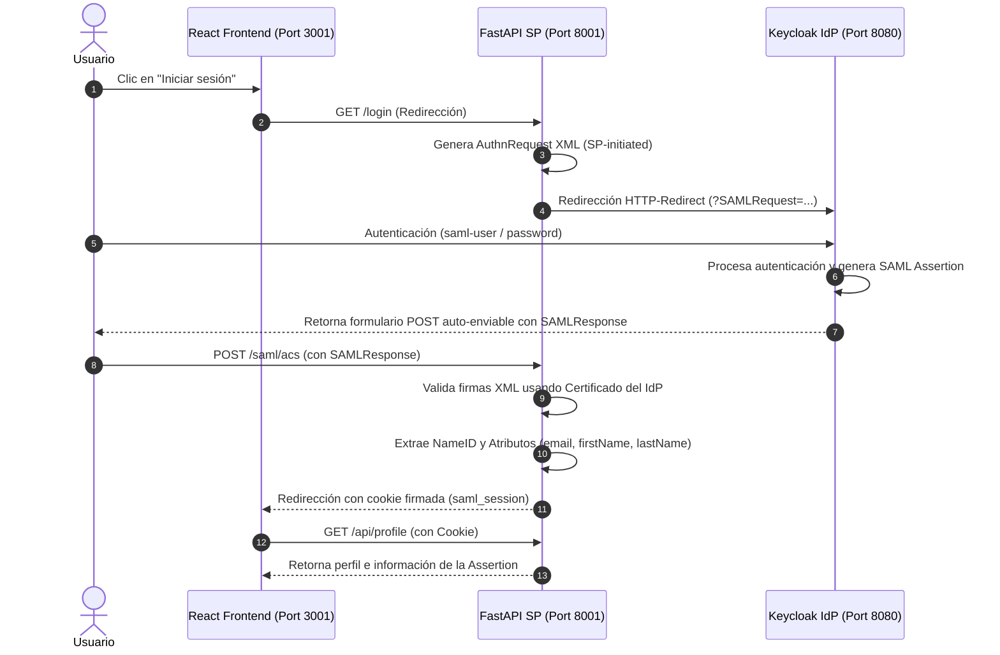

# Flujo de Autenticación SAML 2.0

Este documento detalla el funcionamiento paso a paso del flujo de autenticación **SP-Initiated SAML 2.0** implementado en esta Proof of Concept.

## Diagrama del Flujo

## Explicación Detallada de los Pasos

1. **Intento de Acceso**: El usuario accede al frontend en `http://localhost:3001` y hace clic en "Iniciar sesión con Keycloak (SAML)".
2. **Inicio del Flujo**: El frontend redirige al navegador a `http://localhost:8001/login`.
3. **Generación de la Solicitud**: El Service Provider (FastAPI backend) utiliza la librería `python3-saml` para generar un documento XML `<saml2p:AuthnRequest>`. Este documento contiene el Entity ID de la aplicación, el ACS URL donde se espera recibir la respuesta y el formato del identificador de sujeto solicitado.
4. **Redirección al IdP**: El backend codifica el XML en Base64, lo comprime (Deflate) y redirige al navegador a Keycloak usando el binding **HTTP-Redirect** de SAML:
   `http://localhost:8080/realms/saml-realm/protocol/saml?SAMLRequest=...`
5. **Autenticación en Keycloak**: Keycloak recibe la solicitud, identifica al SP por su Entity ID y presenta el formulario de login. El usuario ingresa sus credenciales (`saml-user` / `password`).
6. **Emisión de la Respuesta**: Tras el éxito, Keycloak genera un XML `<saml2p:Response>` que incluye la firma digital de Keycloak y una `<saml2:Assertion>` firmada con los datos del usuario.
7. **Formulario HTTP-POST**: Keycloak no puede enviar directamente el XML al backend en segundo plano (puesto que el usuario es el que tiene la sesión). En su lugar, responde al navegador con una página HTML que contiene un formulario oculto y un script que hace un POST automático a la dirección del ACS (`http://localhost:8001/saml/acs`).
8. **Recepción en ACS**: El navegador envía la respuesta SAML en el cuerpo del POST.
9. **Validación Criptográfica**: El backend de FastAPI recibe el POST, decodifica el parámetro `SAMLResponse` y lo valida criptográficamente. Para esto:
   - Utiliza el certificado público de Keycloak (descargado automáticamente mediante metadatos).
   - Valida que la firma del documento XML y de las Assertiones sea íntegra.
   - Verifica los timestamps (`NotBefore` y `NotOnOrAfter`) y que el Audience en el XML coincida con el Entity ID del SP.
10. **Extracción de Claims**: Descifrada la Assertion, se extrae el identificador NameID (correo) y los atributos (nombre completo, correo, username).
11. **Cookie de Sesión**: Para evitar procesar el XML en cada endpoint, el backend emite una cookie firmada con clave secreta (`saml_session`) que almacena el NameID e información de vigencia de la sesión, y redirige al frontend.
12. **Acceso Protegido**: El frontend consume `/api/profile` enviando la cookie. El backend comprueba la firma de la cookie y retorna la información personal del usuario y detalles sobre la assertion procesada.
